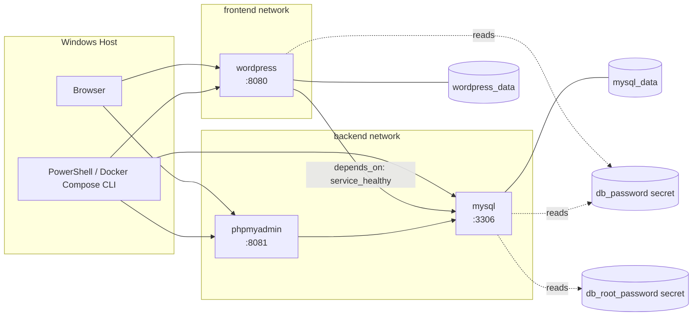

# Docker Compose - WordPress + MySQL

## Overview

This project stands up a fully containerized WordPress blogging stack, WordPress, MySQL, and phpMyAdmin, using Docker Compose instead of individual `docker run` commands. Beyond just getting the stack running, the goal was to build it the way a real deployment would be structured, with named volumes for persistence, network segmentation separating public-facing traffic from the database layer, Docker secrets replacing plaintext credentials, and a healthcheck that gates startup order so WordPress never tries to connect to a database that isn't actually ready yet.

## Medium Article

[Docker Compose - WordPress + MySQL: Network Segmentation, Secrets, and Healthcheck-Gated Startup](https://medium.com/@rester.mcglown/docker-compose-wordpress-mysql-network-segmentation-secrets-and-healthcheck-gated-startup-0c72836bd4ae)

## Architecture



WordPress sits on both networks since it's the only service that needs to be reachable from the browser while also talking to MySQL; MySQL and phpMyAdmin stay backend-only and are never exposed directly beyond their published ports for local testing.

## Technologies Used

- Docker Desktop, Docker Engine, and Docker Compose
- WordPress (latest) as the CMS
- MySQL 8.0 as the database backend
- phpMyAdmin for database inspection
- Docker named volumes for persistent storage
- Docker Compose secrets for credential management
- Docker Compose healthchecks and `depends_on` conditions
- Docker bridge networks for traffic segmentation
- Windows PowerShell
- Git and GitHub

## Project Objectives

The project objectives were to:

- Write a `docker-compose.yml` that brings up WordPress and MySQL together with a single command
- Persist MySQL's data and WordPress's uploads in named volumes, and prove that data survives `docker compose down` without `-v`
- Add phpMyAdmin on a backend-only network to inspect WordPress's database directly
- Segment traffic into explicit frontend and backend networks, keeping MySQL and phpMyAdmin off the public-facing network entirely
- Replace plaintext environment-variable credentials with Docker Compose secrets, and confirm the containers read credentials from mounted secret files instead
- Add a MySQL healthcheck and use `depends_on: condition: service_healthy` so WordPress waits for a genuinely ready database rather than just a started container

## Repository Contents

```
docker-project-compose-wordpress/
|-- docker-compose.yml
|-- secrets/
|   |-- db_password.txt
|   `-- db_root_password.txt
|-- README.md
`-- .gitignore
```

The `secrets/` directory holding the actual credential files is excluded from version control via `.gitignore`; only the `docker-compose.yml` referencing them is committed. Screenshots documenting each phase are included in the accompanying Medium article rather than this repository.

## Business Scenario

The Daily Byte, a small blog network, wants a reproducible way to stand up its WordPress hosting stack without manually wiring together containers, networks, and volumes by hand each time. The ask: a single `docker-compose.yml` that reliably brings up WordPress, its database, and a way to inspect that database, while following the same security and persistence practices a real deployment would need.

## Phase 1: WordPress and MySQL with Docker Compose

The stack started as a minimal two-service `docker-compose.yml`, using the official `wordpress` and `mysql:8.0` images with database credentials passed through environment variables:

```yaml
services:
  mysql:
    image: mysql:8.0
    environment:
      MYSQL_DATABASE: wordpress
      MYSQL_USER: wordpress
      MYSQL_PASSWORD: <placeholder>
      MYSQL_ROOT_PASSWORD: <placeholder>

  wordpress:
    image: wordpress:latest
    environment:
      WORDPRESS_DB_HOST: mysql
      WORDPRESS_DB_USER: wordpress
      WORDPRESS_DB_PASSWORD: <placeholder>
      WORDPRESS_DB_NAME: wordpress
    ports:
      - "8080:80"
```

Bringing the stack up was a single command:

```bash
docker compose up -d
```

Visiting `localhost:8080` in a browser loaded the WordPress setup wizard, where a site title and admin account were created to complete initial setup.

## Phase 2: Persistent Volumes and phpMyAdmin

Named volumes were added for both stateful paths, MySQL's data directory and WordPress's uploads directory, so that content would survive a container being removed:

```yaml
volumes:
  - mysql_data:/var/lib/mysql   # on the mysql service
  - wordpress_data:/var/www/html   # on the wordpress service
```

A phpMyAdmin service was added on a backend-only network, giving direct visibility into the tables WordPress was writing to without needing shell access into the MySQL container:

```yaml
phpmyadmin:
  image: phpmyadmin:latest
  environment:
    PMA_HOST: mysql
  ports:
    - "8081:80"
```

To prove persistence, the stack was brought down without removing volumes, then brought back up:

```bash
docker compose down
docker compose up -d
```

WordPress returned straight to its dashboard, already logged in, with all existing content intact, rather than presenting the setup wizard again, confirming the data lived in the volumes rather than the containers.

## Phase 3: Network Segmentation, Secrets, and Healthchecks

The final stack introduced three changes together, since they reinforce each other conceptually: explicit network boundaries, credential handling, and startup ordering.

**Network segmentation.** Two networks were defined, `frontend` and `backend`. MySQL and phpMyAdmin were placed on `backend` only; WordPress was placed on both, since it's the only service that needs to be reachable from a browser while also needing database access.

**Docker Compose secrets.** Plaintext credentials in environment variables were replaced with Docker Compose secrets, backed by local files:

```yaml
secrets:
  db_password:
    file: ./secrets/db_password.txt
  db_root_password:
    file: ./secrets/db_root_password.txt
```

Both MySQL and WordPress were switched to their `_FILE`-suffixed environment variable variants (`MYSQL_PASSWORD_FILE`, `WORDPRESS_DB_PASSWORD_FILE`, and so on), which tell each image to read the credential from a file path at `/run/secrets/` rather than from the environment variable's value directly.

**Healthcheck and conditional startup.** A healthcheck was added to the MySQL service using `mysqladmin ping`, reading the root password from the mounted secret file rather than hardcoding it:

```yaml
healthcheck:
  test: ["CMD-SHELL", "mysqladmin ping -h localhost -u root -p\"$(cat /run/secrets/db_root_password)\" --silent"]
  interval: 5s
  timeout: 5s
  retries: 10
```

WordPress's `depends_on` was changed from the default list form to the map form with an explicit condition:

```yaml
depends_on:
  mysql:
    condition: service_healthy
```

The complete final `docker-compose.yml`:

```yaml
services:
  mysql:
    image: mysql:8.0
    environment:
      MYSQL_DATABASE: wordpress
      MYSQL_USER: wordpress
      MYSQL_PASSWORD_FILE: /run/secrets/db_password
      MYSQL_ROOT_PASSWORD_FILE: /run/secrets/db_root_password
    volumes:
      - mysql_data:/var/lib/mysql
    networks:
      - backend
    secrets:
      - db_password
      - db_root_password
    healthcheck:
      test: ["CMD-SHELL", "mysqladmin ping -h localhost -u root -p\"$(cat /run/secrets/db_root_password)\" --silent"]
      interval: 5s
      timeout: 5s
      retries: 10

  wordpress:
    image: wordpress:latest
    depends_on:
      mysql:
        condition: service_healthy
    environment:
      WORDPRESS_DB_HOST: mysql
      WORDPRESS_DB_USER: wordpress
      WORDPRESS_DB_PASSWORD_FILE: /run/secrets/db_password
      WORDPRESS_DB_NAME: wordpress
    ports:
      - "8080:80"
    volumes:
      - wordpress_data:/var/www/html
    networks:
      - backend
      - frontend
    secrets:
      - db_password

  phpmyadmin:
    image: phpmyadmin:latest
    depends_on:
      - mysql
    environment:
      PMA_HOST: mysql
    ports:
      - "8081:80"
    networks:
      - backend

volumes:
  mysql_data:
  wordpress_data:

networks:
  backend:
  frontend:

secrets:
  db_password:
    file: ./secrets/db_password.txt
  db_root_password:
    file: ./secrets/db_root_password.txt
```

## Proving Persistence End-to-End

With the final stack running, a test post was created in WordPress. The entire stack was then brought down and back up without removing volumes:

```bash
docker compose down
docker compose up -d
```

`docker compose ps` showed all three services healthy and running, with MySQL reporting `(healthy)` status before WordPress finished starting, confirming the healthcheck and `depends_on` condition were both functioning as intended. The test post was still present in WordPress's blog feed, and logging into phpMyAdmin confirmed the underlying `wp_posts` table still contained the same data, proving persistence held from both the application layer and the database layer.

## Validation

Persistence and startup ordering were validated by direct observation, not by inspecting documentation or assuming Compose defaults:

- **Data persistence:** A WordPress test post and the admin session both survived a full `docker compose down` (without `-v`) and recreation, confirming the named volumes, not the containers, were holding the data.
- **Database consistency:** phpMyAdmin showed the same WordPress database tables and data after recreation, confirming the database layer persisted independently of the application layer.
- **Secrets handling:** WordPress and MySQL both connected successfully using credentials read from mounted secret files rather than environment variables, confirming the `_FILE` variable pattern worked as documented.
- **Startup ordering:** `docker compose ps` showed MySQL reach `(healthy)` status before WordPress finished starting, confirming `depends_on: condition: service_healthy` actually gated WordPress's startup rather than just recording a dependency.

## Engineering Decisions

- **Docker Compose over individual `docker run` commands.** Compose was used to declare the entire stack, services, volumes, networks, and secrets, in a single reproducible file, rather than wiring each container together by hand.
- **Separate volumes for MySQL data and WordPress uploads.** Rather than a single shared volume, each service's persistent state was isolated in its own named volume, keeping their lifecycles independently manageable.
- **Two networks instead of one flat network.** `frontend` and `backend` were split explicitly so that MySQL and phpMyAdmin, which never need to be reachable from outside the Docker host except through their published ports for local testing, aren't sitting on the same network as anything public-facing.
- **Docker secrets over environment variables for credentials.** The `_FILE`-suffixed environment variables supported by both the MySQL and WordPress images were used specifically so credentials could be sourced from Compose secrets instead of being visible in plaintext via `docker inspect` or the compose file itself.
- **`depends_on` with a healthcheck condition instead of a plain list.** A plain `depends_on: - mysql` only waits for the container to start, not for MySQL to actually accept connections; the healthcheck-gated condition was used specifically to close that gap.

## Security and Operational Considerations

- **Secrets files are excluded from version control.** The `secrets/` directory containing the actual credential files is listed in `.gitignore`; only the `docker-compose.yml` referencing their paths is committed, so credentials never end up in the repository history.
- **Network segmentation limits blast radius.** Keeping MySQL and phpMyAdmin off the `frontend` network means that even if the WordPress container were compromised, direct network-level access to the database from outside the backend network is still restricted by Docker's own network isolation.
- **Healthchecks prevent a class of startup-time failures.** Without the `service_healthy` condition, WordPress could attempt its first database connection before MySQL has finished initializing, particularly on a slower host or first-ever startup when MySQL has to initialize its data directory. The healthcheck removes that race condition entirely.
- **Default phpMyAdmin exposure.** phpMyAdmin's port is published for local development convenience; in a production deployment this would sit behind authentication and a reverse proxy rather than being reachable directly, and ideally wouldn't be exposed publicly at all.

## Lessons Learned

- Docker Compose's YAML structure is strict about indentation in a way that's easy to get wrong when copy-pasting or hand-editing: a service's properties (`image`, `environment`, `volumes`, and so on) must be indented one level deeper than the service name itself, or Compose fails with an unhelpful "did not find expected key" error rather than pointing at the exact line.
- `depends_on` has two distinct forms, a plain list and a map with `condition:`, and only the map form supports waiting on a healthcheck; the list form only ever waits for a container to start, not for the service inside it to be ready.
- Named volumes prove their value even outside the intended test: WordPress recognizing pre-existing volume data and skipping its setup wizard on a rebuild wasn't the planned first step of the Intermediate tier, but it was the same persistence property already demonstrating itself in practice.
- Reading credentials from files at `/run/secrets/`, rather than passing them as plaintext environment variables, is directly supported by both the WordPress and MySQL images via their `_FILE`-suffixed variables, requiring no extra tooling like a secrets manager for a project at this scale.

## How to Run the Project

```bash
# Create the secrets files first
mkdir secrets
echo "your-db-password" > secrets/db_password.txt
echo "your-root-password" > secrets/db_root_password.txt

# Bring up the full stack
docker compose up -d
```

WordPress: `http://localhost:8080`
phpMyAdmin: `http://localhost:8081`

To prove persistence, the stack can be brought down and back up without losing data:

```bash
docker compose down
docker compose up -d
```

To confirm the configuration is valid without starting anything:

```bash
docker compose config
```

## Future Improvements

A production version of this setup would move the `secrets/` files out of the project directory entirely and integrate with a dedicated secrets manager, add a reverse proxy with TLS in front of WordPress, restrict or remove phpMyAdmin's exposed port in favor of an SSH tunnel or VPN-only access, and add a healthcheck to the WordPress service itself so its own readiness, not just MySQL's, could be monitored and acted on.
